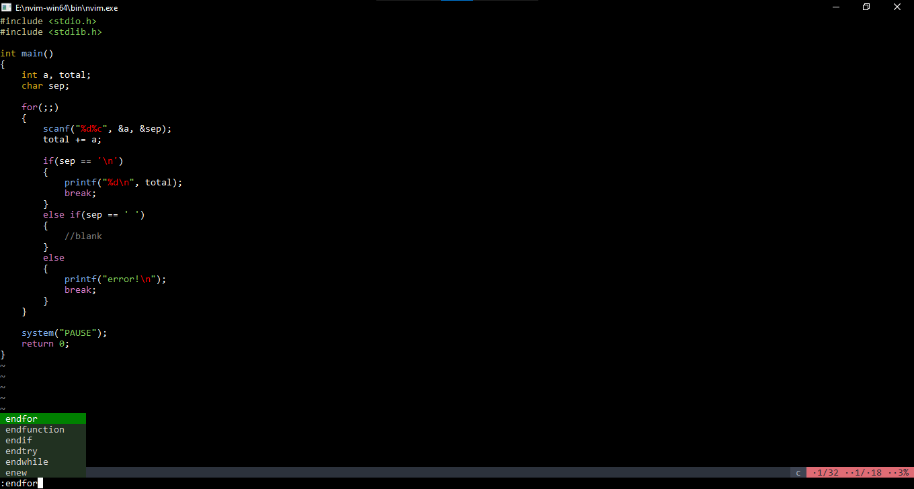

# vim-forest
forest colorscheme for Vim and Neovim.

This is just a plain colorscheme like the one you get after installing vim.

## **Installing**

Just download it like any other plugin, then enable ***termguicolors***.

## **Screenshot**

This one below is using [vim-polyglot](https://github.com/sheerun/vim-polyglot) for better appearance.

